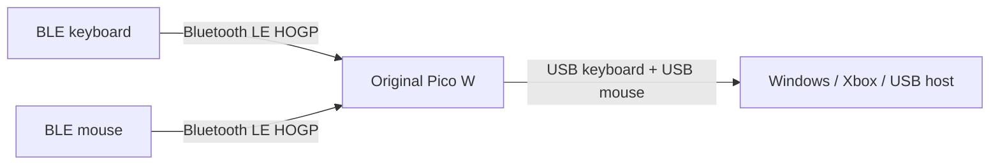

# xbox-pico — BLE keyboard and mouse bridge for Raspberry Pi Pico W

Turn one Bluetooth Low Energy keyboard and one BLE mouse into ordinary wired
USB HID devices using an original Raspberry Pi Pico W. Both peripherals connect
wirelessly to the Pico W; the Pico connects to a Windows PC, Xbox Series X|S,
or another USB host with one Micro-USB data cable.

The tested setup uses a Logitech MX Mechanical keyboard and Logitech M196 mouse.
Both work simultaneously on Windows 11 and in The Sims 4 on Xbox Series X.

> **Public beta:** the tested path works, but compatibility is not universal.
> Xbox mouse support is game-specific, not every BLE peripheral exposes a
> supported HID descriptor, and reconnect/stress/current testing is ongoing.

This project is a derivative of Shiomachi Software's
[`picow_ble_usb_hid_bridge`](https://github.com/shiomachisoft/picow_ble_usb_hid_bridge),
using tag [`20260830_7`](https://github.com/shiomachisoft/picow_ble_usb_hid_bridge/tree/20260830_7)
/ commit [`2c6a303`](https://github.com/shiomachisoft/picow_ble_usb_hid_bridge/commit/2c6a303d1f172e56b271283af978efdcc483a389)
as its foundation. The original history and license are preserved. See
[Origin and credit](#origin-and-credit) and [NOTICE.md](NOTICE.md).

## What this solves

- Use a multi-device BLE keyboard on an Xbox without moving its USB receiver.
- Pair a separate BLE mouse to the same Pico W.
- Present two fixed, standard USB interfaces from power-on: one keyboard and
  one mouse.
- Reconnect both saved devices automatically after power cycles.
- Avoid soldering, breadboards, headers, drivers, or a starter kit.

It does **not** emulate an Xbox controller, bypass licensed-accessory
authentication, or modify the console. A game must explicitly support keyboard
and mouse input.

## Tested hardware

| Component | Result |
|---|---|
| Original Raspberry Pi Pico W / RP2040 | Pass |
| Logitech MX Mechanical, Easy-Switch slot 3 | Pairing, reconnect, and input pass |
| Logitech M196 / M-R0114 | Pairing, reconnect, and input pass |
| Windows 11 | Keyboard, mouse, and simultaneous basic input pass |
| Xbox Series X | Keyboard navigation pass |
| The Sims 4 on Xbox Series X | Keyboard and mouse input pass |

The Xbox Home dashboard does not provide general mouse navigation. Test the
mouse inside a game whose Xbox Store capabilities include `Console Keyboard &
Mouse`.

## What you need

- one **original Raspberry Pi Pico W** (`pico_w`, RP2040);
- one known-good Micro-USB **data** cable;
- one BLE HID keyboard; and
- one BLE HID mouse.

You do not need the Pico starter kit, headers, soldering, GPIO wiring, a UART
adapter, an external power supply, or a second keyboard. Pico 2 W is not the
current release target.

## Install and pair

Start on a Windows PC so input can be checked before moving the Pico to an Xbox.

1. Download
   [`xbox-pico-v0.1.0-beta.1-pico-w.uf2`](https://github.com/n-pouliot/xbox-pico/releases/download/v0.1.0-beta.1/xbox-pico-v0.1.0-beta.1-pico-w.uf2).
2. Unplug the Pico W. Hold its white **BOOTSEL** button while connecting it to
   the PC.
3. Release BOOTSEL when the `RPI-RP2` drive appears.
4. Copy the UF2 file to `RPI-RP2`. The drive disappears automatically and the
   Pico reboots; that is expected.
5. Do not pair the keyboard or mouse in Windows Bluetooth settings. They pair
   directly with the Pico.
6. Put the keyboard into pairing mode. For an MX Mechanical, hold the desired
   Easy-Switch key for about three seconds until it blinks rapidly.
7. When the Pico repeats three short LED flashes and a pause, type `739241` on
   that keyboard and press Enter.
8. Put the BLE mouse into its documented pairing mode. For an M196, hold its
   bottom on/off/pairing button for three seconds until its LED blinks.
9. Wait for the Pico LED to become solid green. Test keyboard and mouse input on
   the PC, then move the same Pico and cable to the target USB host.

The initial enrollment window lasts three minutes. If it expires, unplug and
reconnect the Pico normally—without BOOTSEL—and retry the missing device.
Pairings persist across Pico power cycles.

For screenshots-level detail and recovery steps, follow the
[beginner flashing guide](docs/beginner-flashing.md) or open
[`release/START-HERE.txt`](release/START-HERE.txt).

## Re-pair or replace a device

Maintenance images erase saved state; they do not run the normal bridge or pair
the replacement themselves.

| Replace | First flash | Then |
|---|---|---|
| Keyboard only | [`pico_w_clear_keyboard_pairing_MAINTENANCE.uf2`](release/pico_w_clear_keyboard_pairing_MAINTENANCE.uf2) | Reflash normal firmware and pair the keyboard |
| Mouse only | [`pico_w_clear_mouse_pairing_MAINTENANCE.uf2`](release/pico_w_clear_mouse_pairing_MAINTENANCE.uf2) | Reflash normal firmware and pair the mouse |
| Both devices | [`pico_w_clear_all_pairings_MAINTENANCE.uf2`](release/pico_w_clear_all_pairings_MAINTENANCE.uf2) | Reflash normal firmware and pair both |

Enter BOOTSEL mode for each flash. Wait for a solid LED after a maintenance
image, then reflash the normal beta UF2. Never leave a maintenance image
installed. If power is interrupted during a clear operation or it shows a rapid
failure blink, run **clear all** before returning to normal firmware.

## LED reference

The original Pico W has a single-color green LED.

| Pattern | Meaning |
|---|---|
| Solid | Keyboard and mouse are ready |
| Three short flashes, then a pause | Type `739241` on the keyboard and press Enter |
| One short pulse every 2 seconds | Keyboard ready; mouse absent |
| Two short pulses every 2 seconds | Mouse ready; keyboard absent |
| 500 ms on / 500 ms off | Neither role is ready |
| 200 ms on / 200 ms off | Connection, security, or discovery is active |

After a rejected enrollment, a long pulse followed by one to six short pulses
reports the failed stage for 20 seconds: connection, security, HIDS service,
Report Map, runtime report, or internal failure respectively.

## Compatibility

Keyboard support includes standard keyboard/keypad usages, modifiers, function
keys, navigation keys, multiple BLE Report IDs, and compatible one-bit NKRO
maps translated to USB 6KRO.

Mouse support includes up to five buttons, relative 8- or 16-bit X/Y, vertical
wheel, and horizontal pan. Large movement deltas are split into safe USB
reports rather than discarded.

Current intentional limits:

- BLE HID over GATT (HOGP) only; Bluetooth Classic-only and proprietary
  2.4 GHz-only devices cannot pair with the Pico;
- one keyboard and one mouse, with one HIDS service each;
- no absolute mouse/digitizer input;
- no consumer/media, system-control, macro, or vendor-key forwarding;
- no keyboard Caps/Num/Scroll LED output forwarding;
- no combo keyboard-and-mouse peripheral in one BLE connection; and
- malformed, oversized, ambiguous, or unsupported Report Maps are rejected.

Device names are never trusted to decide a role. The firmware connects,
retrieves the Report Map, validates it with bounded parsing, and classifies the
device from standard HID usages before saving it.

## Security and privacy

- Unknown devices are considered only while an empty-role enrollment window is
  open and are ignored during normal operation.
- Keyboards require the fixed-passkey event plus an authenticated 16-byte LE
  Secure Connections bond.
- Mice use encrypted, bonded Just Works with a standards-compatible 7- to
  16-byte key; legacy fallback is accepted for mouse interoperability.
- Numeric Comparison, passkey entry on the Pico, and OOB pairing are not
  supported.
- Firmware has no internet connection, telemetry, cloud service, or runtime USB
  storage interface.

The fixed keyboard code is public, and mouse Just Works does not authenticate
the peer against an active attacker. Keep unrelated devices out of pairing mode
during the three-minute enrollment window.

## How it works

USB descriptors are fixed from startup. Interface 0 is a boot-capable keyboard
on endpoint `0x81`; interface 1 is a boot-capable mouse on endpoint `0x82`.
There are no USB Report IDs because each function has its own interface.

RP2040 Core 0 services TinyUSB. Core 1 owns BTstack and the CYW43439 radio.
Keyboard and mouse have independent BLE contexts, persistent identities,
generations, and bounded cross-core mailboxes. Disconnect paths prioritize
all-keys-up or all-buttons-up reports so stale input cannot remain held.

Read [architecture.md](docs/architecture.md) for the design decisions and
[test-report.md](docs/test-report.md) for the exact evidence boundary.

## Build and test

The project pins Raspberry Pi Pico SDK 2.2.0 and targets `pico_w`. See
[docs/build.md](docs/build.md) for the reproducible Windows build and native
host-test commands.

Useful engineering records:

- [test report](docs/test-report.md)
- [verified devices](docs/verified_devices.md)
- [troubleshooting](docs/troubleshooting.md)
- [recovery](docs/recovery.md)
- [risks and limitations](docs/risks-and-limitations.md)
- [code review](docs/code-review.md)
- [adversarial review](docs/adversarial-review.md)
- [agent handoff](HANDOFF.md)

SHA-256 checksums for distributed UF2 files are in
[`release/SHA256SUMS.txt`](release/SHA256SUMS.txt).

## Contributing

Compatibility reports are especially valuable. Open a device report with the
exact keyboard/mouse model, board revision, firmware hash, host, LED pattern,
and reproduction steps. See [CONTRIBUTING.md](CONTRIBUTING.md).

## Origin and credit

This repository builds on the original work by
[Shiomachi Software](https://github.com/shiomachisoft) in
[`shiomachisoft/picow_ble_usb_hid_bridge`](https://github.com/shiomachisoft/picow_ble_usb_hid_bridge).
Its Git history through
[commit `2c6a303d1f172e56b271283af978efdcc483a389`](https://github.com/shiomachisoft/picow_ble_usb_hid_bridge/commit/2c6a303d1f172e56b271283af978efdcc483a389)
is retained in this repository.

The upstream project established the Pico W BLE-central-to-USB-HID foundation
using Raspberry Pi's BTstack integration and TinyUSB. This derivative adds the
simultaneous two-device architecture, fixed dual USB topology, defensive Report
Map compiler, role-specific persistence, keyboard passkey workflow, broad mouse
security compatibility, failure diagnostics, maintenance images, host tests,
and Xbox-focused documentation.

Upstream also credits
[`mateibarbu19`](https://github.com/mateibarbu19) for work in its 20260810
release. TinyUSB and BlueKitchen attribution is preserved in
[LICENSE.TXT](LICENSE.TXT) and [NOTICE.md](NOTICE.md).

## License and trademark notice

This is **non-commercial software**. The inherited BlueKitchen demo terms
restrict redistribution, use, and modification to personal benefit and prohibit
commercial purpose or monetary gain. Read [LICENSE.TXT](LICENSE.TXT) before
using or redistributing the project.

Xbox is a trademark of Microsoft. Logitech product names are trademarks of
Logitech. This project is independent, unofficial, and not endorsed by
Microsoft, Logitech, Raspberry Pi, Shiomachi Software, BlueKitchen, or TinyUSB.
